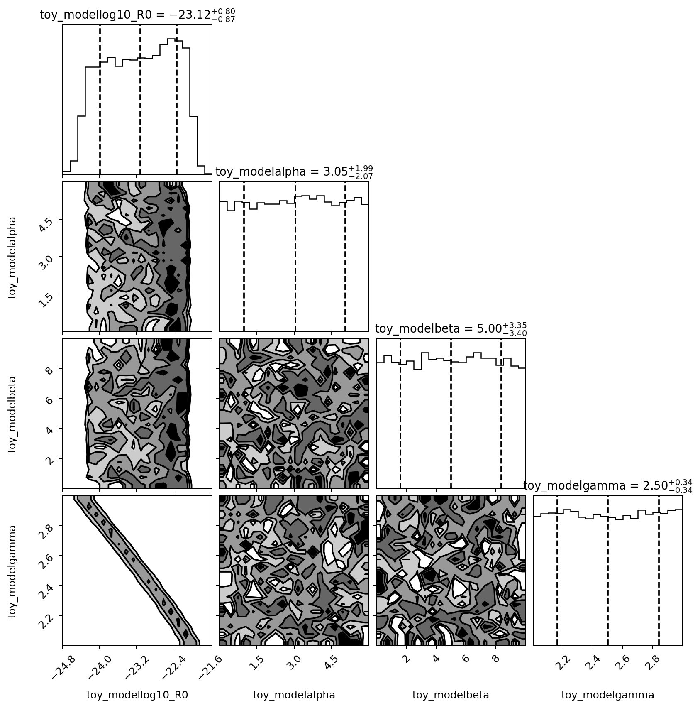
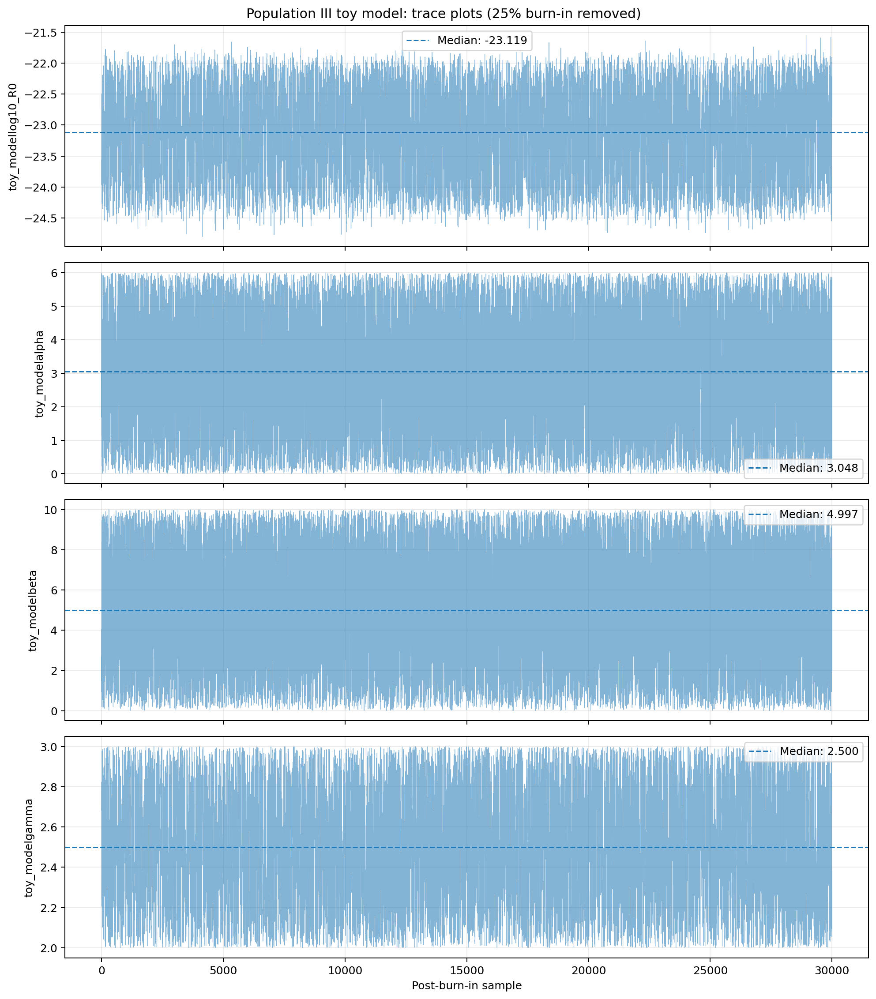
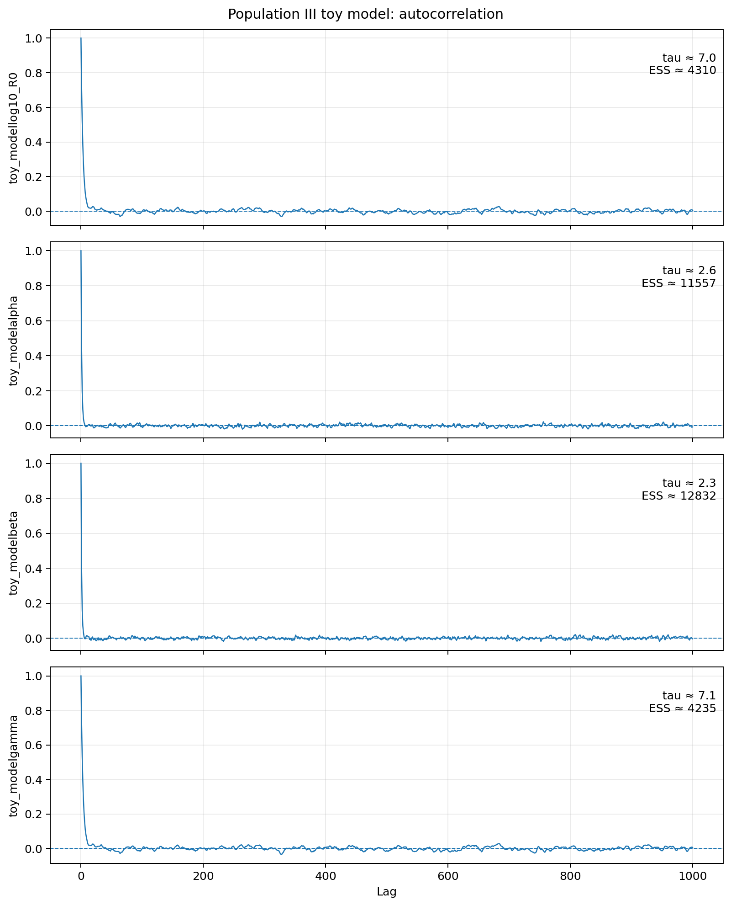

# Population III Gravitational-Wave Background  
## Bayesian Analysis with NANOGrav Pulsar Timing Array Data



This repository contains a Bayesian investigation of a phenomenological
Population III black-hole merger-rate model using a pulsar timing array
likelihood implemented with `ceffyl`.

The project connects a population model for early black-hole mergers to the
stochastic gravitational-wave background and compares the predicted spectrum
with NANOGrav pulsar timing array observations.

The analysis combines scientific computing, numerical integration, Bayesian
inference, Markov chain Monte Carlo sampling, and posterior diagnostics.

---

## Scientific objective

Population III stars are expected to have formed from nearly primordial gas
during the early Universe. Their remnants may have contributed to the
formation and growth of the first black-hole populations.

A cosmological population of black-hole mergers generates a stochastic
gravitational-wave background. Pulsar timing arrays can constrain this
background at nanohertz frequencies.

This project investigates which combinations of phenomenological Population
III merger-rate parameters are compatible with the PTA likelihood.

The model contains four sampled parameters:

| Parameter | Role |
|---|---|
| `log10_R0` | Merger-rate normalization |
| `alpha` | Population-model shape parameter |
| `beta` | Population-model shape parameter |
| `gamma` | Redshift-evolution parameter |

The parameters should not necessarily be interpreted as independently
measured astrophysical quantities. The likelihood may constrain combinations
of parameters rather than each parameter separately.

---

## Analysis workflow

The main workflow is:

```text
Population III merger-rate model
                ↓
Integration over mass and redshift
                ↓
Gravitational-wave power spectral density
                ↓
ceffyl PTA likelihood
                ↓
PTMCMCSampler posterior sampling
                ↓
Burn-in removal and chain diagnostics
                ↓
Posterior interpretation
```

The numerical pipeline:

1. Defines a phenomenological Population III merger-rate model.
2. Integrates the population contribution over mass and redshift.
3. Computes the corresponding gravitational-wave spectrum.
4. Evaluates the spectrum using the `ceffyl` likelihood.
5. Samples the posterior with `PTMCMCSampler`.
6. Produces trace plots, autocorrelation diagnostics, and a corner plot.
7. Estimates integrated autocorrelation times and effective sample sizes.

---

## Repository structure

```text
popiii-nanograv-bayesian-analysis/
├── docs/
│   └── repository_rebuild.md
├── figures/
│   ├── autocorrelation_corrected.png
│   ├── corner_corrected.png
│   └── traceplot_corrected.png
├── results/
│   ├── chain_1.txt
│   └── pars.txt
├── src/
│   ├── diagnostic_pop3_corrected.py
│   ├── run_pop3.py
│   └── sampler_utils.py
├── requirements.txt
└── README.md
```

### `src/`

Contains the maintained scientific analysis and diagnostic scripts.

### `results/`

Contains the stored PTMCMC chain and the corresponding parameter names.

### `figures/`

Contains the corrected posterior and convergence diagnostics.

### `docs/`

Contains technical notes describing the repository reconstruction, dependency
cleanup, diagnostic correction, and scientific interpretation.

---

### `requirements.txt`

Lists the Python packages required by the complete scientific analysis.

---

## Main results

The posterior indicates that the four model parameters are not constrained
equally.

### Merger-rate normalization

`log10_R0` is meaningfully constrained by the PTA likelihood.

This shows that the overall amplitude of the predicted gravitational-wave
background contains information about the normalization of the merger-rate
model.

### Shape parameters

The posterior distributions of `alpha` and `beta` remain broadly similar to
their priors.

They are therefore largely prior dominated in the current analysis.

This does not mean that these parameters have no physical importance. It
means that the present likelihood and model configuration do not contain
enough information to measure them independently.

### `R0–gamma` degeneracy

The posterior displays an important degeneracy between `log10_R0` and
`gamma`.

Different combinations of merger-rate normalization and redshift evolution
can produce similar effective gravitational-wave amplitudes in the PTA
frequency range.

The main scientific interpretation is therefore:

> The PTA likelihood primarily constrains an effective amplitude combination
> involving `R0` and `gamma`, rather than independently measuring all four
> phenomenological parameters.

---

## Corrected diagnostics

The original diagnostic workflow removed the final metadata columns of the
stored chain but did not correctly remove the initial MCMC samples as burn-in.

The corrected workflow is implemented in:

```text
src/diagnostic_pop3_corrected.py
```

It produces:

- corrected trace plots;
- corrected posterior corner plot;
- autocorrelation functions;
- integrated autocorrelation-time estimates;
- effective sample-size estimates.

Approximate corrected diagnostics are:

| Parameter | Integrated autocorrelation time | Effective sample size |
|---|---:|---:|
| `log10_R0` | ~7.0 | ~4,300 |
| `alpha` | ~2.6 | ~11,500 |
| `beta` | ~2.3 | ~12,800 |
| `gamma` | ~7.1 | ~4,200 |

These values apply to the stored chain and should not be interpreted as
universal properties of the model.

---

## Posterior figures

### Corrected corner plot


The corner plot shows the one-dimensional marginal posteriors and the
two-dimensional parameter correlations.

The most important visible structure is the correlation between `log10_R0`
and `gamma`.

### Corrected trace plot



The trace plot provides a visual assessment of chain mixing and stationarity
after the corrected treatment of burn-in.

### Autocorrelation



The autocorrelation curves quantify how rapidly the stored samples become
approximately independent.

---

## Software and dependencies

The analysis was developed in Python and uses scientific and Bayesian
inference tools including:

- NumPy;
- SciPy;
- Matplotlib;
- `ceffyl`;
- `PTMCMCSampler`;
- `enterprise_extensions`.

The analysis imports the official installed `ceffyl` implementation directly:

```python
from ceffyl.Ceffyl import ceffyl, signal
```

An unnecessary local copy of `Ceffyl.py` was removed after confirming that it
contained no executable differences from the installed package.

---

## Installation and usage

Clone the repository and enter the project directory:

```bash
git clone https://github.com/AndreCaire/popiii-nanograv-bayesian-analysis.git
cd popiii-nanograv-bayesian-analysis
```

### Reproducing the stored-chain diagnostics

The posterior diagnostics can be reproduced directly from the chain stored in `results/`.

Install the packages required by the diagnostic script:

```bash
python -m pip install numpy matplotlib corner
```

Run:

```bash
python src/diagnostic_pop3_corrected.py
```

The script:

- removes the first 25% of the stored chain as burn-in;
- calculates posterior quantiles;
- estimates integrated autocorrelation times;
- estimates effective sample sizes;
- regenerates the trace, corner, and autocorrelation plots.

The generated files are saved in:

```text
figures/
```

### Running the complete Bayesian analysis

Install the complete project dependencies with:

```bash
python -m pip install -r requirements.txt
```

The complete PTMCMC analysis is implemented in:

```text
src/run_pop3.py
```

Running the full analysis additionally requires compatible external `ceffyl`
likelihood data and correct configuration of its local data path. These
external data files are not included in this repository.

---

## Sampler utilities

The file:

```text
src/sampler_utils.py
```

is a reduced project-specific adaptation of sampler utilities distributed
with `ceffyl`.

It retains the jump proposals and sampler setup required by this analysis
while omitting upstream functionality that was not used in the current
workflow.

The implementation is derived from code associated with:

- `ceffyl`;
- `enterprise_extensions`;
- `PTMCMCSampler`.

The relevant upstream attribution and licensing requirements should be
preserved in future distributions of this repository.

---

## Reproducibility status

The repository currently preserves:

- the maintained analysis scripts;
- the corrected diagnostic script;
- the stored posterior chain;
- the parameter-name file;
- the main posterior figures;
- documentation of the reconstruction and scientific interpretation.

Complete reproduction of the PTMCMC run still requires:

1. A compatible Python environment.
2. The required `ceffyl` likelihood data.
3. Correct configuration of the external data path.
4. Sufficient computational time for posterior sampling.

A requirements file is provided for dependency installation. Exact version
pinning and fully automated environment reproduction remain future repository
improvements.

---

## Limitations

This project uses a phenomenological Population III merger-rate model.

The results should therefore be interpreted as constraints within the chosen
model and prior assumptions, not as a complete astrophysical reconstruction
of the Population III black-hole population.

Additional limitations include:

- strong parameter degeneracies;
- prior-dominated shape parameters;
- dependence on the selected likelihood and frequency representation;
- dependence on the assumed population parameterization;
- incomplete environment pinning;
- reliance on external `ceffyl` likelihood data.

---

## Future improvements

Planned improvements include:

- pinning exact dependency versions and adding a reproducible environment file;
- documenting how to obtain and configure the external likelihood data;
- removing hard-coded paths from the analysis;
- introducing command-line arguments or a configuration file;
- adding automated tests for the spectrum calculation;
- validating the numerical integration independently;
- comparing alternative Population III merger-rate models;
- performing prior-sensitivity tests;
- producing posterior predictive spectra;
- comparing the model with additional PTA datasets.

---

## Repository reconstruction

The repository was rebuilt from the original research workflow to separate
maintained source code, posterior outputs, figures, and documentation.

A detailed record of the reconstruction is available at:

```text
docs/repository_rebuild.md
```

This document explains:

- removal of the unnecessary local `Ceffyl.py`;
- retention of the reduced sampler utilities;
- correction of the burn-in analysis;
- organization of the repository;
- interpretation of the posterior constraints.

---

## Author

**André Pinheiro de Andrade Caire**

Physics researcher working with gravitational-wave backgrounds, Bayesian
inference, numerical modeling, and scientific Python.

---

## Acknowledgements

The author gratefully acknowledges **Prof. Patricia Schmidt**
(UNESP) for her supervision, guidance, and continuous support during the
development of this research.

---

## Disclaimer

This repository documents an academic research analysis and remains under
active development.

The stored results should be interpreted together with the model assumptions,
priors, likelihood configuration, and reproducibility limitations described
above.
